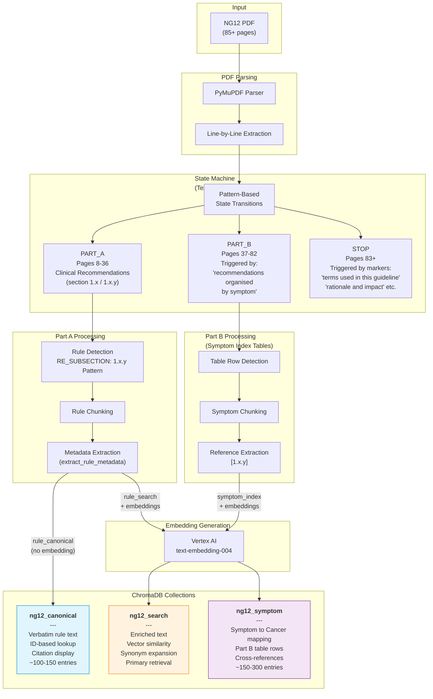
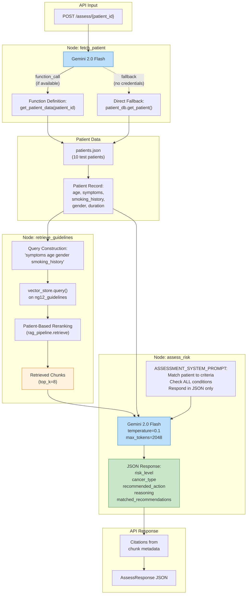
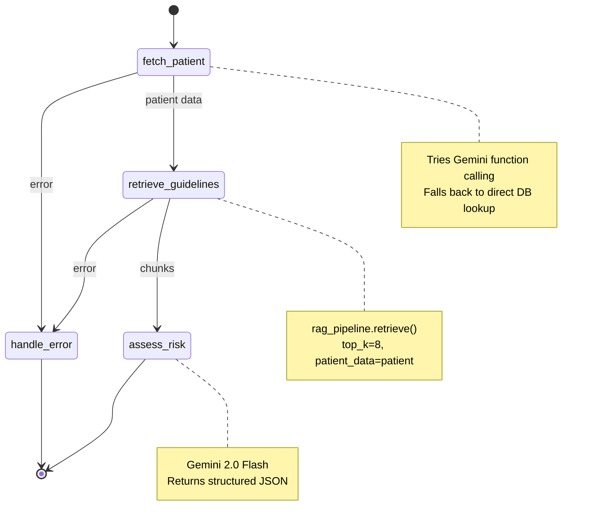
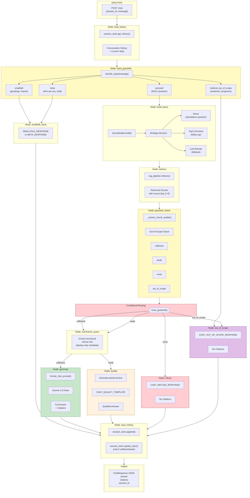
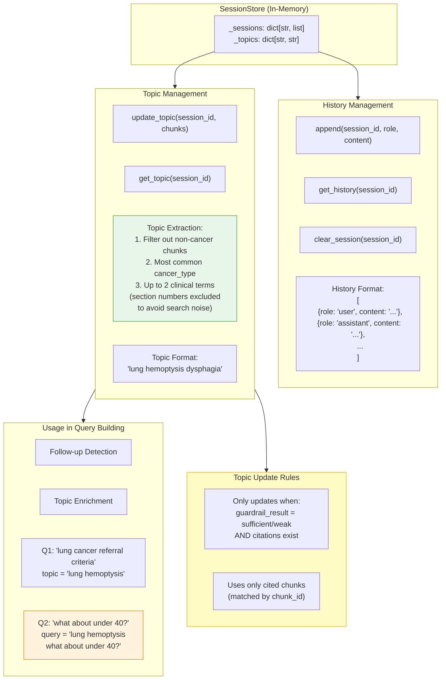
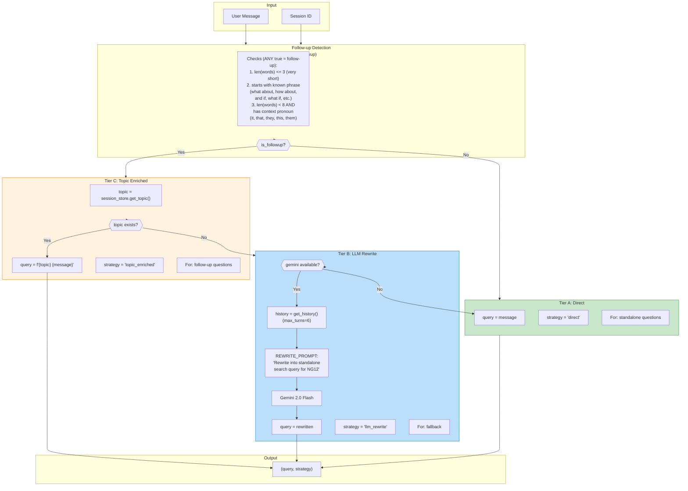
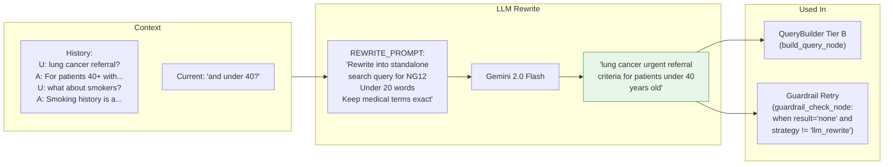
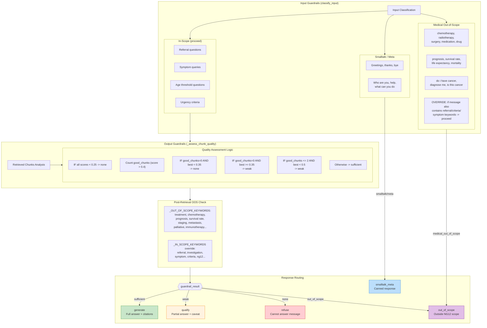
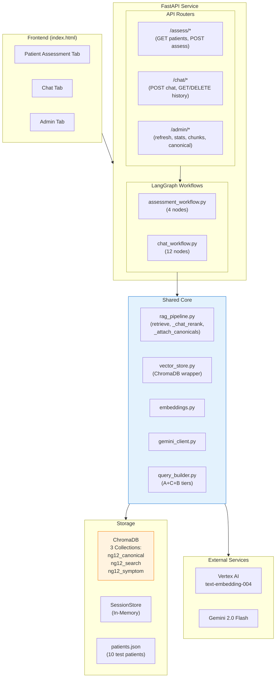

# NG12 Assessor Architecture Diagrams

## 1. PDF Ingestion Pipeline



### Collection Details

| Collection | Contents | Purpose | Query Method |
|-----------|---------|------|---------|
| **ng12_canonical** | Original rule text with full metadata | Citation display, Admin page | ID lookup (`get_canonical(rule_id)`) |
| **ng12_search** | Enriched text + synonym expansion | Primary semantic retrieval | Vector similarity |
| **ng12_symptom** | Symptom-to-cancer mapping (Part B table rows) | Symptom index cross-references | Vector + metadata filter |

### Chunk Metadata by Type

| Field | rule_canonical | rule_search | symptom_index |
|-------|:-:|:-:|:-:|
| `section` | Y | Y | - |
| `action_type` | Y | - | - |
| `cancer_type` | Y | Y | - |
| `page` / `page_end` | Y | Y | Y |
| `age_min` / `age_max` | Y | - | - |
| `symptom_keywords_json` | Y | - | - |
| `risk_factor_smoking` | Y | - | - |
| `urgency` | Y | - | - |
| `gender_specific` | Y | - | - |
| `system_title` / `sub_title` | - | - | Y |
| `symptom` / `possible_cancer` | - | - | Y |
| `references_json` | - | - | Y |
| `rule_id` | - | Y | - |

---

## 2. Patient Assessment Workflow



### LangGraph Workflow Nodes



---

## 3. Chat Workflow (LangGraph)



---

## 4. Retrieval Pipeline (Detailed)

```mermaid
flowchart TB
    subgraph EntryA["Assessment Entry<br/>POST /assess/{patient_id}"]
        PatientID["patient_id"]
        FetchPat["fetch_patient()"]
        PatientData["patient_data:<br/>age, symptoms,<br/>smoking_history, gender"]
        QueryBuildA["Query Construction:<br/>f'{symptoms} age {age}<br/>{gender} {smoking_history}'"]

        PatientID --> FetchPat --> PatientData --> QueryBuildA
    end

    subgraph EntryB["Chat Entry<br/>POST /chat"]
        UserMsg["user message"]
        QB["QueryBuilder.build()<br/>(A+C+B tiers)"]
        SearchQuery["search_query"]

        UserMsg --> QB --> SearchQuery
    end

    subgraph Retrieve["retrieve(query, top_k, patient_data)"]
        FetchK["fetch_k = top_k x 3<br/>(assessment: 24, chat: 18)"]

        subgraph VectorQuery["vector_store.query(query, fetch_k)"]
            SearchColl["ng12_search"]
            SymColl["ng12_symptom"]
            VS["Cosine Similarity<br/>score = 1 - distance"]
        end

        CandidatePool["Candidate Pool<br/>(mixed rule_search +<br/>symptom_index chunks)"]

        FetchK --> VectorQuery
        SearchColl --> VS
        SymColl --> VS
        VS --> CandidatePool
    end

    QueryBuildA --> |"top_k=8<br/>patient_data=patient"| FetchK
    SearchQuery --> |"top_k=6<br/>patient_data=None"| FetchK

    subgraph ModeCheck["Mode Branch"]
        HasPatient{{"patient_data?"}}
    end

    CandidatePool --> HasPatient

    subgraph AssessRerank["Assessment Reranking<br/>(deterministic patient-based)"]
        direction TB
        LoopA["For each chunk in candidates:"]
        AB1["+0.15 if patient_age >= age_min"]
        AB2["+0.15 if patient_age < age_max"]
        AB3["+0.10 per symptom keyword overlap<br/>(fuzzy: cs in ps or ps in cs)"]
        AB4["+0.10 if smoker + risk_factor_smoking"]
        AB5["+0.05 if gender matches<br/>-0.30 if gender clashes"]
        AScore["result.score += boost"]

        LoopA --> AB1 --> AB2 --> AB3 --> AB4 --> AB5 --> AScore
    end

    subgraph ChatRerank["Chat Reranking<br/>_chat_rerank(query, results)"]
        direction TB
        Intent["Detect query intent:<br/>q_urgency (urgent|red flag|emergency)<br/>q_age (age|under N|over N|years old)<br/>q_duration (weeks|months|persistent)<br/>q_exact (quote|exact|verbatim)"]
        LoopC["For each chunk in candidates:"]
        CB1["+0.10 if q_urgency AND<br/>chunk.urgency in<br/>{immediate, very_urgent, urgent}"]
        CB2["+0.10 if q_age AND<br/>chunk has age_min or age_max"]
        CB3["+0.10 if q_duration AND<br/>chunk text matches duration regex"]
        CB4["+0.15 if q_exact AND<br/>doc_type == 'rule_search'"]
        CScore["result.score += boost"]

        Intent --> LoopC --> CB1 --> CB2 --> CB3 --> CB4 --> CScore
    end

    HasPatient --> |"Yes"| AssessRerank
    HasPatient --> |"No"| ChatRerank

    subgraph Select["Sort and Select"]
        SortDesc["results.sort(score, descending)"]
        TopK["results = results[:top_k]<br/>(assessment: top 8, chat: top 6)"]
        SortDesc --> TopK
    end

    AScore --> SortDesc
    CScore --> SortDesc

    subgraph Canonical["_attach_canonicals(results)"]
        CanonicalColl["ng12_canonical<br/>Collection"]

        subgraph RuleAttach["For each rule_search chunk"]
            RuleLookup["get_canonical(rule_id)<br/>e.g. rule_id='1.1.1'"]
            RuleResult["Attach:<br/>canonical_text<br/>canonical_metadata"]
            RuleLookup --> RuleResult
        end

        subgraph SymAttach["For each symptom_index chunk"]
            RefParse["Parse references_json<br/>e.g. ['[1.5.2]', '[1.1.1]']"]
            RefStrip["Strip brackets<br/>'[1.5.2]' -> '1.5.2'"]
            RefLookup["get_canonical(rule_id)<br/>for each reference"]
            SymResult["Attach:<br/>referenced_canonicals[]<br/>{rule_id, text, metadata}"]
            RefParse --> RefStrip --> RefLookup --> SymResult
        end

        CanonicalColl --> RuleLookup
        CanonicalColl --> RefLookup
    end

    TopK --> RuleAttach
    TopK --> SymAttach

    subgraph Output["Output"]
        Results["Retrieved Chunks list:<br/>chunk_id, text, metadata,<br/>score, canonical_text,<br/>canonical_metadata,<br/>referenced_canonicals"]
    end

    RuleResult --> Results
    SymResult --> Results

    style EntryA fill:#e1f5fe,stroke:#0288d1
    style EntryB fill:#e8f5e9,stroke:#43a047
    style VectorQuery fill:#fff3e0,stroke:#f57c00
    style AssessRerank fill:#fff3e0,stroke:#f57c00
    style ChatRerank fill:#e8f5e9,stroke:#43a047
    style Canonical fill:#f3e5f5,stroke:#7b1fa2
```



### Score Calculation Details

```
final_score = base_vector_similarity + boost

=== Assessment Mode (patient_data provided) ===

┌──────────────────────────────────────────────────────────┐
│  Boost Type          │ Condition                │ Value   │
├──────────────────────────────────────────────────────────┤
│  Age Min Match       │ patient_age >= age_min    │ +0.15  │
│  Age Max Match       │ patient_age < age_max     │ +0.15  │
│  Symptom Overlap     │ per overlapping keyword   │ +0.10  │
│  Smoking Match       │ smoker + risk_factor=True │ +0.10  │
│  Gender Match        │ same gender               │ +0.05  │
│  Gender Clash        │ opposite gender           │ -0.30  │
└──────────────────────────────────────────────────────────┘

=== Chat Mode (no patient_data) ===

┌──────────────────────────────────────────────────────────┐
│  Boost Type          │ Condition                │ Value   │
├──────────────────────────────────────────────────────────┤
│  Urgency Match       │ query has urgent/red flag │ +0.10  │
│  Age Query           │ query mentions age/years  │ +0.10  │
│  Duration Query      │ query has weeks/months    │ +0.10  │
│  Exact Wording       │ query has quote/verbatim  │ +0.15  │
└──────────────────────────────────────────────────────────┘

Example (Assessment Mode):
Query: "55 year old male with hemoptysis"
Patient: age=55, symptoms=["hemoptysis"], smoking="Current Smoker"

Chunk: [1.1.1] Lung cancer urgent referral for haemoptysis, 40+
  - Vector similarity: 0.72
  - Age min match (55 >= 40): +0.15
  - Symptom overlap (hemoptysis): +0.10
  - Smoking match: +0.10
  - Gender match (Male): +0.05
  ─────────────────────────────
  Final Score: 1.12
```

---

## 5. Chat Detail Diagrams

### 5.1 Memory & Topic Management



### 5.2 Query Builder Strategy (A+C+B Tiers)



### 5.3 Query Rewriting / Summarization



### 5.4 Input/Output Guardrails



### Guardrail Response Templates

```
┌──────────────────────────────────────────────────────────────────┐
│ sufficient -> Full Response (generate_node)                      │
├──────────────────────────────────────────────────────────────────┤
│ {LLM generated answer with [Source N] citations}                 │
│                                                                   │
│ Sources (cleaned by clean_answer_sources):                        │
│ [NG12 §1.1.1, p.9] - Lung cancer referral criteria              │
│ [NG12 §1.1.2, p.9] - Urgent chest X-ray                         │
└──────────────────────────────────────────────────────────────────┘

┌──────────────────────────────────────────────────────────────────┐
│ weak -> Qualified Response (CHAT_QUALIFY_TEMPLATE)               │
├──────────────────────────────────────────────────────────────────┤
│ Based on the limited evidence found in the NG12 guidelines,      │
│ I can share the following, but please note this may not fully    │
│ address your question:                                            │
│                                                                   │
│ {partial_answer}                                                  │
│                                                                   │
│ For a more complete answer, you may want to ask about a          │
│ specific cancer type, symptom, or referral pathway.              │
└──────────────────────────────────────────────────────────────────┘

┌──────────────────────────────────────────────────────────────────┐
│ none -> Refuse Response (CHAT_REFUSE_RESPONSE)                   │
├──────────────────────────────────────────────────────────────────┤
│ I don't have sufficient evidence in the NG12 guidelines to       │
│ answer this question. The retrieved passages don't appear to     │
│ be relevant enough to provide a grounded response.               │
│                                                                   │
│ Could you try:                                                    │
│ - Asking about a specific cancer type (e.g., lung, breast)       │
│ - Asking about a specific symptom (e.g., haemoptysis)            │
│ - Asking about referral criteria for a particular age group      │
└──────────────────────────────────────────────────────────────────┘

┌──────────────────────────────────────────────────────────────────┐
│ out_of_scope -> Out-of-Scope Response (CHAT_OUT_OF_SCOPE_...)    │
├──────────────────────────────────────────────────────────────────┤
│ This question appears to fall outside the scope of the NG12      │
│ Suspected Cancer: Recognition and Referral guideline.            │
│                                                                   │
│ NG12 covers criteria for referring patients with suspected       │
│ cancer symptoms for urgent investigation or specialist           │
│ assessment.                                                       │
│                                                                   │
│ I can help with questions about:                                  │
│ - Which symptoms trigger urgent referral for specific cancers    │
│ - Age thresholds and risk factors for referral criteria          │
│ - The difference between urgent referral and investigation       │
│ - Safety netting recommendations                                  │
└──────────────────────────────────────────────────────────────────┘

┌──────────────────────────────────────────────────────────────────┐
│ smalltalk -> Greeting Response (SMALLTALK_RESPONSE)              │
├──────────────────────────────────────────────────────────────────┤
│ Hello! I'm a clinical guidelines assistant specializing in       │
│ the NICE NG12 guideline for suspected cancer recognition         │
│ and referral.                                                     │
│                                                                   │
│ I can help you with:                                              │
│ - Referral criteria for specific cancer types                     │
│ - Age thresholds and risk factors                                 │
│ - Understanding urgent referral vs urgent investigation           │
│ - Safety netting recommendations                                  │
└──────────────────────────────────────────────────────────────────┘

┌──────────────────────────────────────────────────────────────────┐
│ meta -> System Info Response (META_RESPONSE)                      │
├──────────────────────────────────────────────────────────────────┤
│ I'm a clinical decision support assistant that answers questions │
│ about the NICE NG12 guideline: Suspected Cancer - Recognition    │
│ and Referral.                                                     │
│                                                                   │
│ I use RAG to find relevant guideline passages and provide        │
│ grounded answers with citations. I only answer based on the      │
│ NG12 guideline content.                                           │
└──────────────────────────────────────────────────────────────────┘
```

---

## System Architecture Overview


